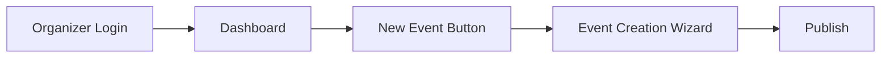

# **Ticketa - Event Ticketing Platform**  

## **Project Overview**  
**Ticketa.** is a full-featured event management and ticketing platform built with **Django**, designed to empower:  
- **Event organizers** to create, manage, and promote events.  
- **Attendees** to discover, purchase tickets, and save events.  
- **Administrators** to oversee platform operations.  

The platform combines **Django’s backend robustness** with the modern interactivity of **Alpine.js** and the sleek design of **Tailwind CSS**.  

## **Key Features**  

### **🎟️ Core Functionality**  
- **User authentication system** (registration, login, password reset).  
- **Event creation wizard** with rich text editing.  
- **Ticket type configuration** (general admission, VIP, early bird).  
- **Secure checkout process** with payment integration.  
- **Digital ticket generation and management**.  

### **Admin Features**  
- **Comprehensive dashboard** for event organizers.  
- **Sales analytics and reporting**.  

### **User Experience**  
- **Responsive design** for all devices.  
- **Interactive event browsing** with filters.  

## **Technology Stack**  

### **Backend**  
| Technology | Description | Why It Was Chosen |
|------------|-------------|-------------------|
| **** | High-level Python web framework. | Provides **built-in security** (CSRF, SQL injection protection), **scalability**, and a **batteries-included** approach (admin panel, ORM, auth). Ideal for rapid development of complex platforms like TicketA. |
| **** | Relational database system. | Chosen for **ACID compliance**, **performance** with large datasets (e.g., event/ticket records), and **Django’s native support**. Supports JSON fields for flexible event metadata. |

### **Frontend**  
| Technology | Description | Why It Was Chosen |
|------------|-------------|-------------------|
| **** | Utility-first CSS framework. | Enables **rapid UI development** with responsive design out-of-the-box. Eliminates context-switching between HTML/CSS, perfect for dynamic interfaces like event dashboards. |
| **** | Lightweight JavaScript framework. | Provides **reactivity** (e.g., dynamic ticket counters) without the overhead of heavier frameworks like React. Integrates seamlessly with Django templates. |
| **** | Library for dynamic HTML. | Allows **AJAX-like behavior** (e.g., filtering events, cart updates) without writing JavaScript. Reduces frontend complexity while maintaining interactivity. |

### **Services**  
| Technology | Description | Why It Was Chosen |
|------------|-------------|-------------------|
| **** | Payment processing API. | Industry-standard for **secure transactions**, supports **global payments**, and handles PCI compliance. Django’s Stripe library simplifies integration. |

## **Project Screenshots**  

### **1. Landing Page**  
  
  
  
*Clean, modern homepage showcasing featured events with search functionality.*  

### **2. Event Details Page**  
  

- Click on any event card to see full details.  
- View:  
  - Event description (with rich text formatting).  
  - Date/time with location (map integration).  
  - Available ticket types with pricing.  
  - Organizer information.  

### **3. Buy Tickets**  
  
- Select from available options (e.g., General Admission, VIP).  
- View price breakdown and any included perks.  

### **4. Checkout Process**  
  
*Secure checkout flow with ticket selection, attendee details, and payment processing.*  

## **For Staff Members or Organizers**  

### **🔐 Authentication Prerequisites**  
**Before creating events, organizers must:**  
1. **Register an Organizer Account**  
     
   - Click **"Register"**.  

2. **Login**  
     
   - Use credentialed login (username/password).  

### **🎪 Event Creation Flow (Post-Authentication)**  

**Key Restrictions:**  
- ⚠️ Attempting to access `/create-event` redirects to login.  

### **3. User Dashboard**  
  
Personalized dashboard showing upcoming events, past purchases, and saved events. 

### **4. Event Creation**  
  
Multi-step form for organizers to create events with ticket options, dates, and rich descriptions.  

### **5. Event and Ticket Listing**  
  
Comprehensive event view with description, ticket options. 

## **Installation**  
### **Prerequisites**  
- Python 3.10+  
