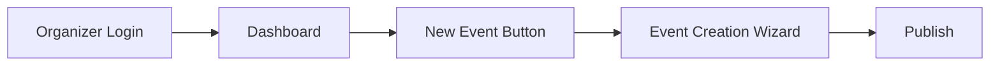

# TicketA - Event Ticketing Platform

## Table of Contents
- [Project Overview](#project-overview)
- [Key Features](#key-features)
- [Technology Stack](#technology-stack)
- [Screenshots](#screenshots)
- [Installation](#installation)
- [Usage Guide](#usage-guide)
- [API Endpoints](#api-endpoints)
- [Contributing](#contributing)
- [License](#license)

## Project Overview

Ticketa is a full-featured event management and ticketing platform built with Django that enables:
- **Event organizers** to create, manage, and promote events
- **Attendees** to discover, purchase tickets for, and save events
- **Administrators** to oversee platform operations

The platform combines the robustness of Django's backend with the modern interactivity of Alpine.js and the sleek design of Tailwind CSS.

## Key Features

### 🎟️ Core Functionality
- User authentication system (registration, login, password reset)
- Event creation wizard with rich text editing
- Ticket type configuration (general admission, VIP, early bird)
- Secure checkout process with payment integration
- Digital ticket generation and management

### 🛠️ Admin Features
- Comprehensive dashboard for event organizers
- Real-time attendance tracking
- Sales analytics and reporting
- Bulk attendee management tools

### ✨ User Experience
- Responsive design for all devices
- Interactive event browsing with filters
- Personalized event recommendations
- Social sharing capabilities

## Technology Stack

### Backend
- **Django 4.2** - Full-stack web framework
- **PostgreSQL** - Relational database

### Frontend
- **Tailwind CSS 3.3** - Utility-first CSS framework
- **Alpine.js 3.12** - Lightweight JavaScript framework
- **HTMX** - Dynamic content loading

### Services
- **Stripe** - Payment processing

## Screenshots

### 1. Landing Page

*Clean, modern homepage showcasing featured events with search functionality*

2. **Event Details Page**

   - Click on any event card to see full details
   - View:
     - Event description (with rich text formatting)
     - Date/time with location (map integration)
     - Available ticket types with pricing
     - Organizer information
     - Social sharing buttons

### 2. Buy Tickets

   - Select from available options (e.g., General Admission, VIP)
   - View price breakdown and any included perks

### 3. Checkout Process

*Secure checkout flow with ticket selection, attendee details, and payment processing*

# FOR STAFF MEMBER OR ORGANISERS

### 🔐 Authentication Prerequisites
**Before creating events, organizers must:**
1. **Register an Organizer Account**

   

   - Click "Sign Up" 

3. **Login**

   

   - Use credentialed login (username/password)

### 🎪 Event Creation Flow (Post-Authentication)

**Key Restrictions:**
- ❌ Unauthenticated users see disabled "Create Event" buttons
- ⚠️ Attempting to access `/create-event` redirects to login

### 4. User Dashboard

*Personalized dashboard showing upcoming events, past purchases, and saved events*

### 2. Event Creation

*Multi-step form for organizers to create events with ticket options, dates, and rich descriptions*

### 5. Event and Ticket Page listing

*Comprehensive event view with description, ticket options, and interactive map*

## Installation

### Prerequisites
- Python 3.10+
